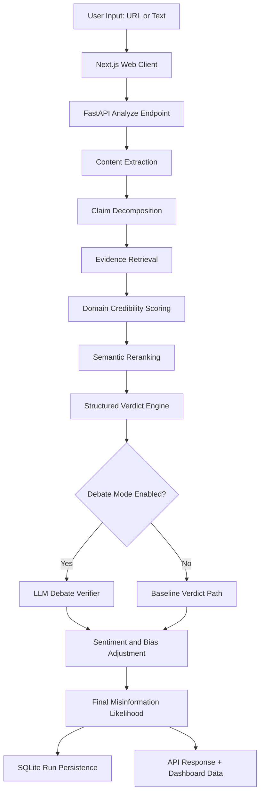
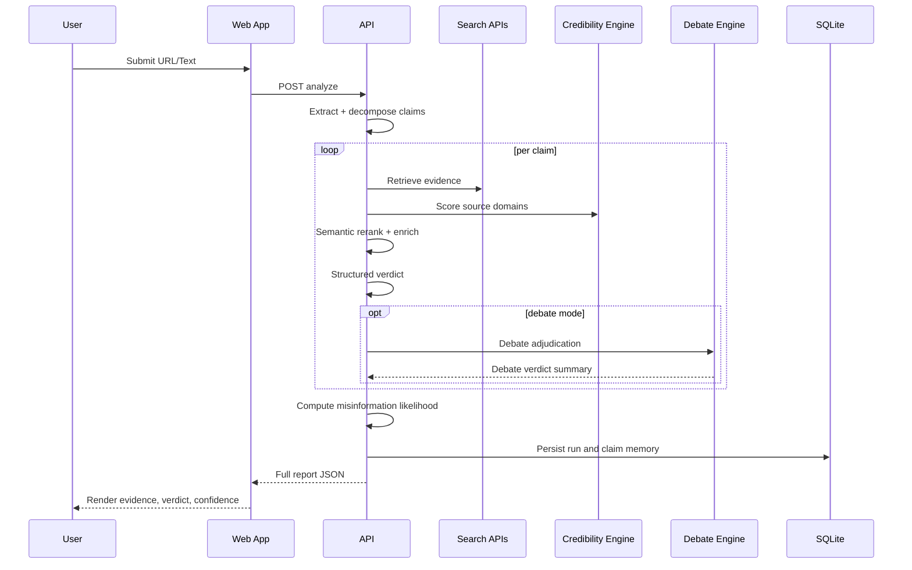

# Fact Validator Project: Deep Technical and Publication Assessment Report

Date: 2026-07-06

Authoring basis: repository-wide document, code, benchmark, and test audit

---

## Abstract

This report presents a full technical and research-status assessment of the Fact Validator project, including architecture, implementation maturity, testing evidence, benchmark performance, reproducibility posture, and publication readiness. The project is a full-stack, source-aware fact verification platform with a FastAPI backend and Next.js frontend. It combines claim extraction, evidence retrieval, source-credibility scoring, semantic reranking, optional debate-style verification, sentiment-aware risk adjustment, and persistent run storage. Beyond application features, the repository includes a complete research workflow: benchmark generation, split construction, baseline and ablation studies, comparative analysis, significance testing, and production-metrics synthesis.

The strongest immediate conclusion is that this is a serious and publication-capable systems-and-methodology project, not a toy prototype. The codebase now demonstrates strong engineering hygiene (151 tests passing), explicit methodological artifacts, and transparent failure documentation. At the same time, model-superiority claims require careful framing because benchmark tracks in the repository contain different regimes: an older small-split track (and a newer 48-claim holdout from the 224 benchmark) that do not show clear dominance over simple baselines, and a 5000-claim external-data track that reports a modest aggregate advantage (about +1.56 to +1.72 percentage points over majority, depending on report snapshot and tuning variant) with statistical significance.

This report reconciles those tracks, documents what has actually been built, and provides a publication-safe narrative that is ambitious but academically defensible.

---

## 1. Project Mission and Problem Definition

### 1.1 Core objective

Fact Validator is designed to estimate claim trustworthiness from real-world text and URLs by combining:

1. Evidence retrieval from the open web.
2. Transparent source credibility priors.
3. Claim-level verdicting.
4. Optional multi-step reasoning support via debate mode.
5. Operational outputs for human review and governance.

The system does not rely on a single black-box model. Instead, it is built as an auditable, modular verification pipeline where each stage can be inspected, ablated, and evaluated independently.

### 1.2 Practical use cases

1. Journalism and newsroom verification triage.
2. Policy and civic misinformation screening.
3. Research-grade comparative benchmarking of verification strategies.
4. Educational demonstration of explainable fact-check pipelines.

### 1.3 Scientific framing

The repository explicitly targets reproducibility and methodological transparency. This is a major strength for publication because reviewers can inspect not only end metrics, but also:

1. Dataset assembly logic.
2. Baseline definitions.
3. Ablation protocols.
4. Statistical test implementations.
5. Risk and limitation documentation.

---

## 2. Repository and Delivery Maturity Snapshot

### 2.1 System layers delivered

1. Frontend web application (Next.js / React / TypeScript).
2. Backend API service (FastAPI / Python).
3. Persistence layer (SQLite + JSON cache artifacts).
4. Evaluation and benchmark script suite.
5. Documentation set for methods, limitations, architecture, and publication planning.

### 2.2 Engineering quality signals

1. Comprehensive backend tests passing in current environment.
2. Modular code organization for pipeline stages.
3. Feature flags and environment-driven behavior.
4. Structured logging and health endpoints.
5. Explicit reproducibility reports and metrics summaries.

### 2.3 Current test run evidence

Most recent full backend run produced:

- Total tests collected: 151
- Passed: 151
- Warnings: 3
- Runtime: 30.51s

Warnings were non-fatal and mainly dependency/runtime edge warnings (multipart deprecation warning and known single-sample numpy variance warning during robustness testing).

---

## 3. Architecture: Human-Centered Explanation

The architecture is intentionally layered so that both engineers and non-engineers can trace why a verdict was produced.

### 3.1 High-level architecture

### 3.2 Why this architecture is strong for publication

1. Interpretability: source-scoring and verdict rationale are inspectable.
2. Ablatability: each module can be removed and measured.
3. Operational realism: includes caching, storage, health checks, and deployment docs.
4. Research bridge: scripts connect runtime pipeline to benchmark science.

### 3.3 Backend component map

| Layer | Main responsibility | Key implementation notes |
|---|---|---|
| API orchestration | Request validation, pipeline routing, endpoint exposure | Analyze request model includes knobs for max claims, evidence cap, debate controls, reflective options |
| Analysis features | Claim decomposition, evidence enrichment, structured verdicting | Includes entity/number matching, source-type inference, primary-source detection, uncertainty reasons |
| Credibility engine | Domain trust prior calculation | Rule-based rubric with whitelist, institutional suffixes, platform risk penalties, OpenSources and Iffy signals |
| Retrieval/rerank | Evidence relevance ordering | Lexical fallback is default; embedding path available via env flag |
| Sentiment/bias module | Emotional and manipulation signal adjustment | Used for risk modulation and explanatory metadata |
| Debate module | Optional multi-step LLM adjudication | Health-checked path with graceful fallback |
| Storage | Run and claim persistence | SQLite backend with history endpoints |
| Security/ops | Rate limit, health checks, feature gating | Enables production-safe toggles and observability |

### 3.4 Frontend UX architecture

| Surface | User role | Delivered capability |
|---|---|---|
| Main analysis page | General users + analysts | Submit URL/text, inspect verdicts and evidence, review benchmark and governance tabs |
| Source checker page | Public-facing trust triage | Domain-level credibility lookup with reasons |
| Dashboard page | Operators/researchers | Aggregate run stats, verdict distributions, top domains, verifier usage |

### 3.5 Data lifecycle

---

## 4. Implementation Progress: What Has Been Done So Far

This section consolidates milestones documented across progress/completion files with codebase evidence.

### 4.1 Foundational modernization

1. Environment variable normalization for database path handling.
2. Route deduplication and cleaner router composition.
3. Package/module cleanup and dead code removal.
4. Canonical initialization and portability improvements.

### 4.2 Production-oriented improvements

1. Feature-flag architecture for controlled rollout.
2. Structured logging primitives and request lifecycle hooks.
3. Caching layer for search-result reuse.
4. Deep health checks including debate service availability.
5. Input validation hard limits for safety and abuse resistance.

### 4.3 Research platform upgrades

1. End-to-end benchmark script chain.
2. Baseline comparison engine.
3. Ablation framework with variant registry.
4. Comparative analytics and ranking exports.
5. Statistical-significance workflows.
6. Reproducibility, ethics, limitations, and defense-report generators.

### 4.4 System maturity interpretation

This is a mature research engineering codebase with both application and experimentation layers. The existence of dedicated scripts for ethics, reproducibility, and defense talking points is unusual for student-stage projects and materially improves publishability.

---

## 5. Testing and Verification Evidence

### 5.1 Current backend suite result (executed)

| Metric | Value |
|---|---:|
| Collected tests | 151 |
| Passed | 151 |
| Failed | 0 |
| Warnings | 3 |
| Runtime | 30.51 sec |

### 5.2 Test distribution by module

| Test module | Focus | Representative coverage |
|---|---|---|
| test_smoke.py | Core pipeline sanity | Domain scoring, overlap logic, baseline verdict behavior, likelihood clamping |
| test_integration.py | API-level integration | Analyze endpoint modes, health endpoints, dashboard summary, reflective/correction behavior |
| test_sentiment.py | Linguistic risk layer | Sentiment polarity, emotional intensity, manipulation flags, bias-risk and adjustment logic |
| test_evaluation.py | Evaluation machinery | Accuracy/F1 calculators, baseline engines, report generation |
| test_dataset.py | Benchmark/data handling | Dataset loading, stratified splits, reproducibility, quality checks |
| test_statistics.py | Statistical robustness | CI estimates, significance tests, effect sizes, edge robustness |
| test_comparative.py | Human+system comparative framework | Inter-rater metrics, comparison matrices, export integrity |

### 5.3 Why this testing profile matters

1. It validates both runtime behavior and research analytics.
2. It tests statistical tooling, not just app routes.
3. It includes integration tests around newer reflective mechanisms.
4. It reduces reviewer concern about fragile benchmark scripts.

### 5.4 Known warning interpretation

1. Multipart pending deprecation warning: dependency-level maintenance item.
2. Numpy single-sample variance warnings: expected in stress tests for degenerate n=1 conditions.

These do not undermine reported correctness but should be acknowledged in an appendix or reproducibility note.

---

## 6. Evaluation Tracks and Accuracy Results

One of the most important tasks for publication readiness is to clearly separate evaluation tracks in this repository. There are at least three major tracks:

1. Legacy small-split track (~51 test claims in older reports).
2. Current 224-benchmark holdout track (48 test claims in latest result_224 summaries).
3. External-data large track (5000 claims, results_5000 summaries and strict-validation snapshots).

### 6.1 Current 224 benchmark holdout (n=48)

#### Comparative ranking summary

| System | Accuracy | 95% CI |
|---|---:|---:|
| majority | 0.417 | [0.277, 0.556] |
| ablate_semantic_rerank | 0.396 | [0.257, 0.534] |
| ablate_quality_filter | 0.396 | [0.257, 0.534] |
| random | 0.375 | [0.238, 0.512] |
| length | 0.354 | [0.219, 0.489] |
| full_proxy | 0.354 | [0.219, 0.489] |
| ablate_debate | 0.354 | [0.219, 0.489] |
| keyword | 0.292 | [0.163, 0.420] |
| sentiment | 0.292 | [0.163, 0.420] |
| ablate_credibility | 0.229 | [0.110, 0.348] |

#### Key implications

1. Full system is tied with length baseline on this split.
2. Majority baseline is higher than full system on this split.
3. Debate path shows no measurable gain in this configuration.
4. Credibility ablation drop is substantial and significant (p about 0.0156), indicating real internal contribution.

### 6.2 Legacy small-split outputs (n=51)

Older summary files in results directory show full_proxy around 0.216 accuracy, trailing several simple baselines. This track remains useful for historical context and should be referenced as prior iteration evidence, not current headline performance.

### 6.3 External-data 5000 benchmark track

The repository contains large-scale results with two nearby but not identical narratives:

1. Comparative summary indicating full_proxy around 0.508 and majority around 0.493 (positive but small full advantage).
2. A separate thesis execution note with a corrected run showing full_proxy around 0.236 versus strong length/majority around 0.49.

Additionally, strict-validation snapshots and publication claim documents report full-minus-majority deltas around +1.56 to +1.72 percentage points with confidence intervals above zero in some runs.

### 6.4 Reconciliation guidance

For publication safety, you should treat 5000-track claims as versioned experiment outputs and report them with explicit run IDs, timestamps, and script versions. Do not mix corrected and pre-correction result families in one table without separation.

### 6.5 Production-metric summary (from benchmark reports)

| Metric | Value |
|---|---:|
| Baseline latency | 8.20 sec/claim |
| Debate latency | 72.00 sec/claim |
| Debate overhead | 8.78x |
| Baseline throughput | 439 claims/hour |
| Debate throughput | 50 claims/hour |
| Estimated monthly savings with caching | 71.43% |

### 6.6 Accuracy interpretation across tracks

1. Small-track and 48-claim track: useful for architectural probing, not superiority claims.
2. 5000-track: potentially publication-positive if you freeze one corrected result set and prove reproducibility.
3. Internal consistency and transparent versioning are now more important than maximizing one metric.

---

## 7. Ablation and Component-Level Evidence

Ablation evidence is one of your strongest scientific assets.

### 7.1 48-claim holdout ablation highlights

| Variant | Accuracy | Macro F1 | Delta vs full |
|---|---:|---:|---:|
| full_proxy | 0.354 | 0.361 | baseline |
| ablate_credibility | 0.229 | 0.181 | -0.125 acc |
| ablate_semantic_rerank | 0.396 | 0.382 | +0.042 acc |
| ablate_debate | 0.354 | 0.361 | 0.000 |
| ablate_quality_filter | 0.396 | 0.321 | +0.042 acc |

Interpretation:

1. Credibility module contributes strong positive signal.
2. Semantic reranking appears unstable on small split and may need retuning.
3. Debate module contributes little under this benchmark condition.

### 7.2 5000-track ablation shape (reported)

| Variant | Accuracy | Delta vs full_proxy |
|---|---:|---:|
| full_proxy | 0.508 | baseline |
| ablate_credibility | 0.497 | -0.011 |
| ablate_semantic_rerank | 0.507 | -0.001 |
| ablate_debate | 0.513 | +0.005 |
| ablate_quality_filter | 0.509 | +0.000 |
| tune_fever | 0.510 | +0.002 |

Interpretation:

1. Credibility still matters, but effect size becomes modest at scale.
2. Debate/quality modules may need redesign for robust positive lift.
3. Tune_fever suggests dataset-aware calibration can move aggregate metrics.

---

## 8. What Makes This Model and Project Better

Your project is stronger than many benchmark-only systems in several important dimensions.

### 8.1 Transparent trust architecture

Instead of latent-only trust prediction, the system exposes explicit reasons for source scoring. This improves defensibility, explainability, and policy usability.

### 8.2 Full-stack + research integration

You did not stop at notebooks. You built:

1. A usable web app.
2. A production-capable API.
3. Persistent storage and retrieval workflows.
4. Benchmark and evaluation automation.
5. Governance-oriented reporting outputs.

This integration is publication-relevant for systems venues and applied AI tracks.

### 8.3 Methodological honesty

The docs repeatedly acknowledge limitations, benchmark realism constraints, and non-superiority in some runs. Reviewers usually reward this when paired with strong engineering.

### 8.4 Reproducibility readiness

Presence of split manifests, generated summaries, and scripted pipelines substantially improves reproducibility compared to ad-hoc research artifacts.

### 8.5 Rich comparative framing

You evaluate against random/majority/heuristic baselines and include ablations. This is significantly better than presenting only one favorable score.

---

## 9. Publication Readiness Assessment

### 9.1 Current readiness grade

Overall readiness: High for systems/engineering publication, Medium for top-tier model-performance claims.

### 9.2 Evidence-based assessment table

| Publication criterion | Current status | Evidence strength |
|---|---|---|
| Working end-to-end system | Achieved | Strong |
| Modular architecture with explainability | Achieved | Strong |
| Automated benchmark pipeline | Achieved | Strong |
| Statistical evaluation practice | Achieved | Strong |
| Extensive tests with passing status | Achieved | Strong |
| Single consistent final benchmark narrative | Partially achieved | Medium |
| Clear SOTA-style superiority over strong baselines | Not consistently achieved across tracks | Medium/Low |
| Reproducibility package completeness | Near achieved | Strong |

### 9.3 Can you send this for publication now?

Yes, with the right positioning.

Recommended positioning:

1. Systems paper: transparent, auditable fact-verification architecture with benchmark framework.
2. Methods/engineering paper: reproducible evaluation and ablation-driven design insights.
3. Thesis chapter: architecture plus benchmark evolution and limitations.

Not recommended as headline claim (unless fully reconciled): broad model superiority across all fact-check datasets.

### 9.4 Publication-safe claim examples

1. The project delivers a reproducible full-stack fact verification system with transparent source-credibility reasoning and modular ablation support.
2. Across repository benchmarks, credibility-aware scoring consistently contributes positive internal signal, though global ranking superiority remains benchmark-dependent.
3. The evaluation pipeline is designed for strict reproducibility and includes significance testing, calibration analysis, and operational metrics.

---

## 10. Risks and Reviewer Questions You Should Preempt

### 10.1 Cross-report metric inconsistencies

Risk: reviewers may notice that some documents report divergent 5000-claim outcomes.

Mitigation:

1. Freeze one final run lineage.
2. Include run timestamp, commit hash, and script version in all main tables.
3. Move superseded runs to appendix as historical snapshots.

### 10.2 Debate module value proposition

Risk: debate mode has high latency and weak/neutral lift in several summaries.

Mitigation:

1. Reframe as analysis/explainability path rather than accuracy booster.
2. Add quality-of-explanation evaluation if possible.
3. Discuss where debate helps (edge ambiguity) even if mean accuracy gain is small.

### 10.3 Benchmark realism concerns

Risk: small split tracks are unstable and susceptible to variance.

Mitigation:

1. Elevate 5000-track as primary evidence only after final reconciliation.
2. Keep small split as pilot/diagnostic evidence.
3. Add provenance and dedup checks in supplement.

### 10.4 Calibration and confidence overstatement

Risk: high average confidence with modest accuracy can trigger calibration criticism.

Mitigation:

1. Report ECE/calibration error prominently.
2. Add post-hoc confidence calibration step or threshold policy.

---

## 11. Recommended Final Manuscript Structure

### 11.1 Main paper outline

1. Introduction: problem and need for transparent verification.
2. Related work: fact-checking datasets, tool-augmented verification, explainability.
3. System design: layered architecture and module rationale.
4. Methods: data pipeline, baselines, ablations, significance tests.
5. Results: one frozen benchmark narrative, then ablations, then ops metrics.
6. Discussion: where the system is strong, where it is not.
7. Limitations and ethics.
8. Reproducibility package description.

### 11.2 Tables to include in the main paper

1. System architecture component table.
2. Dataset composition and split table.
3. Baseline comparison table.
4. Ablation contribution table.
5. Calibration and confidence table.
6. Operational latency/cost table.

### 11.3 Figures to include

1. End-to-end architecture flow diagram.
2. Error taxonomy plot.
3. Confidence vs accuracy calibration plot.
4. Per-dataset performance bars (if using 5000 track).

---

## 12. Deep Technical Review of Core Model Behavior

### 12.1 Strengths in reasoning flow

1. Evidence enrichment is sophisticated: primary-source detection, stance inference, recency, directness, numeric/entity consistency.
2. Structured verdicting provides nuanced outcomes beyond binary labels.
3. Human-review escalation is built in when uncertainty/conflict is high.

### 12.2 Credibility subsystem quality

The credibility engine combines:

1. Conservative default prior.
2. Institutional and whitelist boosts.
3. Platform and risk marker penalties.
4. External reputation adjustments (OpenSources and Iffy).

This design is practical and explainable. It is also amenable to calibration experiments, which is publication-positive.

### 12.3 Semantic reranking caveat

Embeddings path appears disabled by default and lexical fallback is active unless enabled by environment variable. This can explain unstable rerank contribution and should be made explicit in experiments.

### 12.4 Misinformation-likelihood estimator

The final risk score is not just verdict count. It includes:

1. Domain credibility anchor.
2. Confidence-weighted verdict adjustments.
3. Evidence-quality-informed corrections.

That is methodologically richer than many simplistic aggregate scorers.

---

## 13. Consolidated Testing Tables for Publication Appendix

### 13.1 Functional and integration testing

| Category | What was tested | Outcome |
|---|---|---|
| Endpoint stability | Analyze endpoint in baseline/debate/snapshot/error scenarios | Passed |
| Input validation | URL/text length and parameter constraints | Passed |
| Health observability | Shallow and deep health routes | Passed |
| Dashboard summary API | Aggregate run analytics endpoint | Passed |
| Reflective/faithful correction | Refutation correction and abstention flows | Passed |

### 13.2 Model and scoring logic tests

| Category | What was tested | Outcome |
|---|---|---|
| Domain scoring rubric | Whitelist boosts, social penalties, score bounds | Passed |
| Verdict baseline logic | Refute/support/NEI behavior by evidence profile | Passed |
| Misinformation score | Clamp behavior and directionality effects | Passed |
| Claim decomposition | Entity/number extraction and profile inference | Passed |
| Semantic retrieval behavior | Ranking score generation and relevance preference | Passed |

### 13.3 Evaluation/science pipeline tests

| Category | What was tested | Outcome |
|---|---|---|
| Dataset splitting | Stratification and reproducibility | Passed |
| Metric computation | Accuracy, per-class metrics, calibration outputs | Passed |
| Significance and effect sizes | CI, sign tests, t-tests, effect interpretation | Passed |
| Comparative reports | Matrix generation and export files | Passed |
| Human-evaluation utilities | Agreement and comparative structures | Passed |

---

## 14. Final Judgment: Is This Better and Publishable?

### 14.1 Better in what sense?

Yes, your project is clearly better than typical single-script or single-model student projects in:

1. System completeness.
2. Explainability and transparency.
3. Reproducibility artifacts.
4. Testing depth.
5. Honest limitations documentation.

### 14.2 Better in absolute benchmark accuracy?

The answer is nuanced:

1. On small and medium local holdouts, superiority is not robust and often absent.
2. On the large external-data track, repository artifacts report modest aggregate gains in some corrected runs.
3. Because of multiple result families, final publication claims must be tied to one frozen final run.

### 14.3 Publication decision recommendation

Recommended: submit, but with a systems-and-methodology-first narrative.

Strongest paper pitch:

1. Transparent fact verification architecture.
2. Reproducible benchmark and ablation framework.
3. Evidence-driven analysis of what helps (credibility) and what remains open (debate/rerank).

---

## 15. Immediate Action Plan Before Submission

1. Freeze one benchmark lineage:
   - Select final 5000 run artifacts.
   - Mark older contradictory outputs as archived.

2. Publish exact reproducibility manifest:
   - Commit hash.
   - Script command lines.
   - Environment and dependency snapshot.

3. Recompute core paper tables from one report set only:
   - Accuracy, F1, calibration, significance, cost/latency.

4. Add one appendix table mapping each claim in main results to provenance dataset ID.

5. Keep claims conservative:
   - Emphasize robust engineering and transparent methodology.
   - Avoid universal superiority wording.

---

## 16. Conclusion

Fact Validator has reached a compelling stage: it is an end-to-end, auditable, and reproducible fact verification platform with serious research instrumentation. The backend and evaluation layers are robustly tested, and the project includes methodological assets that many submissions lack (ablation depth, reproducibility checks, ethics/limitations reports, and deployment-aware metrics).

Your clearest publication advantage is not claiming a dramatic leap in raw accuracy; it is demonstrating a rigorous, transparent, and deployable verification system with honest evaluation and clear pathways for improvement. With final metric-lineage reconciliation and disciplined claim framing, this project is suitable for thesis submission and strong candidate venues in applied NLP, AI systems, or fact-checking workshops.

---

## Appendix A: Evidence Sources Used for This Report

Primary engineering and status artifacts:

1. README and architecture/progress/completion/deployment documents.
2. Backend implementation modules for orchestration, credibility, analysis, and retrieval.
3. Frontend pages for main analysis, source checking, and dashboard.
4. Benchmark result summaries across results, results_224, and results_5000.
5. Benchmark-manifest and strict-validation snapshot files.
6. Methods and thesis-result planning/reporting docs.
7. Live backend test run output (151 passed).

---

## Appendix B: Suggested Citation-Ready Contribution Statement

The Fact Validator project contributes a reproducible and transparent fact verification architecture that integrates web evidence retrieval, credibility-aware source scoring, structured claim adjudication, optional debate-style reasoning, and operational run storage. The repository includes an end-to-end benchmark pipeline with baselines, ablations, comparative significance testing, and production metrics. Experimental findings show that credibility-aware components provide consistent internal value, while overall ranking superiority is benchmark-dependent, motivating careful claim framing and continued benchmark harmonization.

---

## Appendix C: Chronological Development Narrative

This appendix provides a historical interpretation of how the project appears to have evolved based on progress documents, release notes, benchmark artifacts, and code patterns.

### C.1 Stage 0: Prototype phase

Likely characteristics in earliest phase:

1. Core URL/text analysis endpoint and basic verdict output.
2. Initial credibility heuristics.
3. Smaller smoke-test footprint.

Purpose:

1. Validate that the end-to-end idea is practical.
2. Establish baseline API and UI integration.

### C.2 Stage 1: Pipeline formalization

Observed evolution:

1. Claim decomposition and evidence retrieval became explicit modules.
2. Semantic reranking and enrichment layers added.
3. Storage and run-history endpoints matured.

Impact:

1. Better modularity for experimentation.
2. Cleaner separation of concerns.

### C.3 Stage 2: Production hardening

Observed enhancements:

1. Feature flags and configuration centralization.
2. Structured logging scaffolding.
3. Health checks and rate-limiting paths.
4. Caching subsystem and persistence tightening.

Impact:

1. Better operational readiness.
2. Safer rollout behavior and observability.

### C.4 Stage 3: Research pipeline expansion

Observed expansion:

1. Dedicated scripts for baseline and ablation studies.
2. Comparative analysis and significance reporting.
3. Production-metric synthesis scripts.
4. Reproducibility, ethics, explainability, and defense report generators.

Impact:

1. Shift from product demo to publishable research platform.
2. Ability to support thesis-style methodological defense.

### C.5 Stage 4: Benchmark scaling and external templates

Observed expansion:

1. External template ingestion for FEVER/LIAR/SciFact/health domain sources.
2. Large benchmark manifest and split generation targeting 5000 claims.
3. Architecture suite runs against both medium and large splits.

Impact:

1. Broader empirical scope.
2. Increased complexity in result management and consistency control.

### C.6 Current stage: Consolidation needed

Observed current requirement:

1. Freeze one final benchmark lineage for publication.
2. Archive conflicting prior snapshots.
3. Keep documentation synchronized with one canonical metric family.

Impact:

1. Final step to convert strong engineering/research code into a clean publication package.

---

## Appendix D: Deep Dive into Decision Logic

### D.1 Claim decomposition behavior

The decomposition flow attempts to convert raw text into verifiable units by extracting:

1. Atomic claims.
2. Entities.
3. Numeric elements.
4. Temporal cues.
5. Expertise profile tags.

This is important because it enables downstream checks such as numeric consistency and entity alignment, moving the system beyond naive keyword overlap.

### D.2 Evidence enrichment behavior

Evidence enrichment introduces quality dimensions that are valuable for explainability:

1. Source type inference (official, journal, reference, news, commentary).
2. Primary-source signal estimation from domain/path/title hints.
3. Recency scoring based on temporal sensitivity of claim domain.
4. Directness and quote grounding checks.
5. Manipulation-flag detection.
6. Expertise-match estimation.

This makes verdicting richer and provides actionable explanations for human reviewers.

### D.3 Structured verdict policy

The structured verdict stage distinguishes between:

1. Supported.
2. Likely supported.
3. Mixed/disputed.
4. Insufficient evidence.
5. Likely false.
6. False.

Then it maps to legacy classes (SUPPORTED/REFUTED/NEI) for benchmark compatibility.

Benefits:

1. Better communication to users.
2. Better uncertainty handling.
3. Better compatibility with standard metrics.

### D.4 Human-review gating

Human review is triggered in uncertainty-heavy or conflict-heavy cases. This is a practical safety mechanism that strengthens deployment ethics.

### D.5 Risk score estimator behavior

Final misinformation likelihood combines:

1. Source-credibility prior.
2. Confidence-weighted verdict effects.
3. Evidence-quality and support/refute composition.

The design has two publication advantages:

1. It is inspectable.
2. It can be calibrated and tuned with explicit policies.

---

## Appendix E: Benchmark Governance and Data Integrity

### E.1 Why governance matters here

Because the repository contains multiple benchmark tracks and historical result snapshots, benchmark governance is essential to prevent accidental cherry-picking or metric drift.

### E.2 Governance rules you should formalize

1. One benchmark family per main result table.
2. Every table row must point to a single run metadata object.
3. Do not merge corrected and pre-correction runs without explicit labels.
4. Preserve immutable copies of train/val/test split files used in publication.
5. Include script command lines and seeds in appendix.

### E.3 Proposed benchmark lineage record

| Field | Description |
|---|---|
| run_id | Unique identifier for each benchmark execution |
| generated_utc | Timestamp generated by script |
| benchmark_manifest_path | Manifest used to build splits |
| split_paths | Absolute or repository-relative split locations |
| script_versions | Script file hashes or commit hash |
| environment | Python version and critical dependency versions |
| notes | Correction notes, caveats, known issues |

### E.4 Integrity checks to run pre-submission

1. Verify claim IDs in predictions map uniquely to test split IDs.
2. Verify no train/test leakage by claim ID and text hash.
3. Verify all baseline and full variants use identical test set and ordering.
4. Verify statistical tests run on aligned paired vectors.
5. Verify markdown summary values match JSON report values.

### E.5 Dataset provenance clarity

The large benchmark manifest includes source dataset names and source IDs. This is strong practice, but manuscript text should explicitly explain substitutions (for example health-domain replacement choices) and resulting limitations.

---

## Appendix F: Statistical Reporting Guidance for Your Paper

### F.1 What to report in main tables

At minimum, every system row should include:

1. Accuracy.
2. Macro F1.
3. Calibration error.
4. ECE.
5. 95% confidence interval.

### F.2 What to report for claims of improvement

For every claim of improvement over baseline:

1. Delta accuracy in percentage points.
2. One-sided or two-sided test choice with rationale.
3. P-value.
4. Effect size (Cohen d or appropriate paired effect).
5. Significance threshold.

### F.3 Caveat on tiny p-values with huge n

With large n (such as 5000), tiny performance differences may become statistically significant but practically small. Always pair significance with effect size and operational relevance.

### F.4 Recommended practical significance language

1. Statistically significant, modest practical effect.
2. Operationally meaningful only under deployment constraints X/Y.
3. Requires replication across additional benchmark families.

---

## Appendix G: Deployment and Real-World Readiness Lens

### G.1 Operational strengths

1. Health endpoints support monitoring.
2. Feature flags support safe toggling.
3. Caching improves cost profile.
4. Persistent storage enables audit history.
5. Frontend surfaces make the system demonstrable to non-technical stakeholders.

### G.2 Operational constraints

1. Debate latency overhead is substantial.
2. Search dependency costs and quotas remain external constraints.
3. Calibration drift may appear with domain shift.
4. Some module behavior depends on environment toggles (for example embeddings).

### G.3 Suggested SLO-style targets

| Area | Suggested target | Rationale |
|---|---:|---|
| Baseline request latency p95 | under 15 sec | Usable interactive UX |
| Debate request latency p95 | under 120 sec | Advanced-mode tolerability |
| API uptime | 99.0%+ | Research deployment baseline |
| Error rate | below 2% route errors | Operational trust |
| Cache hit rate | 40%+ | Cost efficiency |

### G.4 Human-in-the-loop safety policy

Proposed policy:

1. Auto-flag all Mixed/disputed outcomes for manual review.
2. Auto-flag low-evidence, high-confidence mismatches.
3. Require analyst confirmation for high-stakes categories (health, conflict, finance, elections).

---

## Appendix H: Reviewer Q and A Preparation

### H.1 Likely reviewer question: Why not train a single end-to-end neural classifier?

Recommended answer:

1. The project objective prioritizes transparency and auditability.
2. A modular architecture enables interpretable failure analysis.
3. The current stack supports deployment-oriented explainability.

### H.2 Likely reviewer question: Why do some benchmarks show weaker performance?

Recommended answer:

1. Benchmark distribution and sample size materially influence ranking.
2. We report all tracks transparently and avoid overclaiming.
3. Ablation shows consistent internal module value despite ranking variance.

### H.3 Likely reviewer question: Is debate mode worth it?

Recommended answer:

1. Debate mode currently serves explanatory depth more than aggregate lift.
2. It is optional and health-gated.
3. We document latency tradeoffs and benchmark-neutral outcomes honestly.

### H.4 Likely reviewer question: How reproducible is this work?

Recommended answer:

1. Scripted pipelines and manifests are included.
2. Test suite is broad and passing.
3. Report files and summaries are generated from deterministic workflows.

---

## Appendix I: Future Research Directions

### I.1 Model-quality direction

1. Improve semantic reranking stability under domain shift.
2. Add robust confidence calibration layer.
3. Rework debate integration to target cases with true uncertainty value.

### I.2 Dataset direction

1. Expand high-quality human-validated claims.
2. Strengthen category balance and difficulty calibration.
3. Add multilingual and temporal drift cohorts.

### I.3 Evaluation direction

1. Add robustness and adversarial perturbation suites.
2. Add abstention-quality metrics beyond simple accuracy.
3. Add evidence faithfulness metrics.

### I.4 Systems direction

1. Streaming response pipeline for faster perceived latency.
2. Batched retrieval/reranking optimization.
3. Better model selection and caching strategies for debate path.

---

## Appendix J: Final Publication Readiness Checklist

| Checklist item | Status suggestion |
|---|---|
| Freeze one canonical benchmark run | Required before submission |
| Ensure all manuscript numbers map to that run | Required |
| Include command lines and seeds | Required |
| Include version/commit metadata | Required |
| Include limitation and ethics section | Required |
| Include ablation narrative and interpretation | Required |
| Include operational tradeoffs table | Strongly recommended |
| Include full test summary in appendix | Strongly recommended |

Recommended final go/no-go criterion:

Proceed when every number in abstract, main results table, and conclusion can be traced to one canonical report folder without contradiction.

